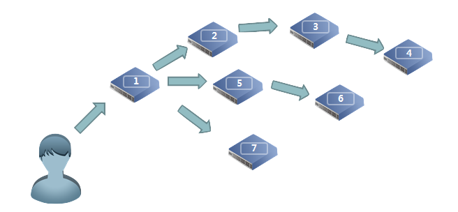
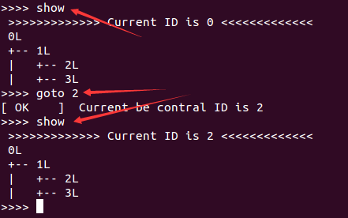
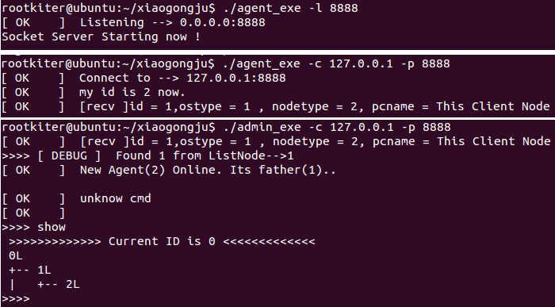

*--> [切换到视频讲解](./video.html) <--*

### 操控逻辑介绍

Termite 将远程主机管理理解为“管理端(admin\_exe)”和“探针端(agent\_exe)”两部分，管理员可以通过“管理端”对探针所属宿主机进行管控。

为了能够适应复杂的网络环境，“探针端”间可以相互连接，进而依赖网络环境形成一个树状结构的“管理拓扑图”，每个管理探针会由“管理端”自动指定一个“身份ID”，通过这个ID管理员可以随意指定当前被管理的是哪一个“探针端”。

### 探针端（agent_exe）

在套件中同时提供了针对不同操作系统及不同CPU的“探针端”，以适用复杂的主机环境，包括但不限于以下设备种类：

1. Linux系统主机
2. MacOS系统主机
3. Windows系统主机
4. 基于Arm-CPU的Linux嵌入式设备（如Android手机，树莓派，小米路由器硬盘版等）
5. 基于Mipsel-CPU的Linux嵌入式设备（如萤石硬盘录像机，小米路由器mini版等）

### 管理端(admin_exe)

套件中的管理端以admin_exe为名，当管理端成功连接到至少一个探针端后，会自动开启一个“内置控制台”，在该控制台下，管理员可以通过 goto 指令切换受控“探针端”，也可以对当前被控的“探针端”下达各种控制指令（架设SOCKS代理服务，以其为网络跳板进行端口转发，文件传输，或把一个命令控制台绑定到本地端口等）。同时，“内置控制台”还支持了 help 指令，辅助查询指令功能及参数等详细信息。

### 探针的工作模式
“探针端”在初始化时，支持两种工作模式：  

1. 服务器模式，样例指令如下：  
*$ ./agent_exe -l 8888*
2. 客户端模式，样例指令如下：  
*$ ./agent_exe -c [server-ip] -p [server-port]*

当“探针端”处于服务器模式时，除可以接受其它“探针端”连接外，还可以接受“管理端”的连接，样例指令如下：  
*$ ./admin_exe -c [server-ip] -p [server-port]*

当管理端连接成功后，首先会进行拓扑图生成操作，这个操作由程序自动实现，无需人工干预，需要花费的时间视节点数量而定。拓扑图生成完毕后，内置shell才能开始正常工作。  

在内置shell中，除常规“功能指令”外，还提供了“listen”和“connect”指令，通过使用这两条指令，还可以在受控探针上启动新的工作模式，用于将新探针纳入管理拓扑中。这就是所谓的“多级级联”，它也是该工具能够进行“跨多层网段转发数据”的基础。

### 内置Shell 

上面介绍了部分内置shell的指令，下面将更系统的介绍内置shell的具体功能，以及使用时的注意事项。  

> 基础指令：  

| | |
|:---|:---|
|0. help | 展示内置shell的指令帮助|
|1. show | 展示当前各“探针端”间的网络拓扑，以及当前被控的探针编号。|

> 探针控制  

| | |
|:---|:---|
|2. goto     [id] | 选定当前被控探针，以探针ID为探针标识 |
|3. listen   [port] | 在被选探针上，开启一个新的“服务器模式”，并等待新探针连接 | 
|4. connect  [ip] [port] | 在被选探针上，开启“客户端模式”，并将其他游离探针加入管理拓扑|

> 服务指令

| | |
|:---|:---|
|5. socks    [lport] | 在被选探针开启一个SOCKSv5的服务器，并将该服务绑定到管理端所在主机的一个端口上 |
|6. lcxtran  [lport] [rhost] [rport] | 从被选探针开启一个端口转发隧道，并将该隧道绑定到管理端所在主机的端口上 |
|7. shell    [lport] |  在被选探针开启一个命令行控制台服务，并将其输入输出绑定到管理端所在主机的一个端口上 |
|8. upfile   [from\_file] [to\_file] | 从本地上传一个文件到被选探针 |
|9. downfile [from\_file] [to\_file] | 从被选探针下载一个文件到本地 |

